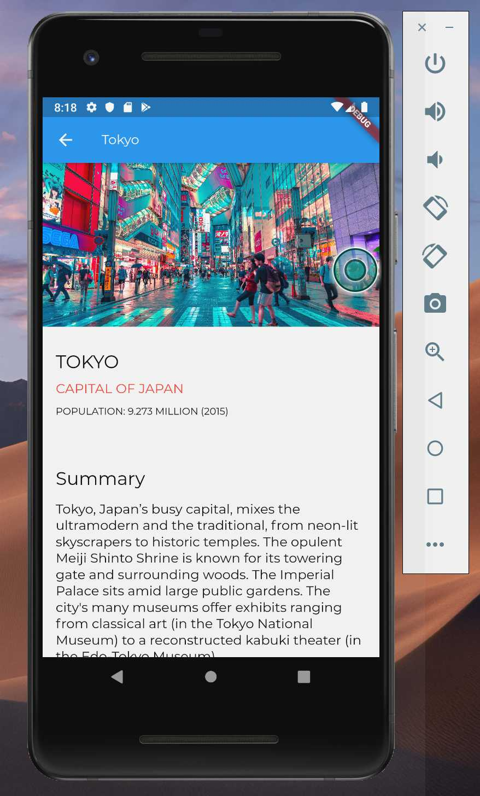

# Flutter lab 2
> Location Infomation

# Flutter lab 2
1. Creating our first screen with `Scaffold`, `Text`, `Image` and `StatelessWidget`
2. Layout Basics with `Column` 
3. Lists using `ListView`
4. Navigation with `Navigator`
5. `StatefulWidget` fundamentals

# Reference
-Wikipedia

- [Youtube - Flutter Crash Course](https://www.youtube.com/channel/UCRCpzcQz-t2ueVihCIx5jDg)
- [Images - unsplash](https://unsplash.com)

